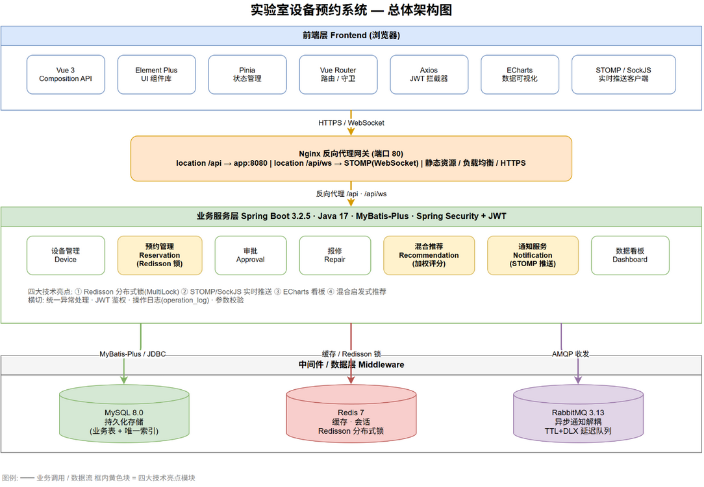
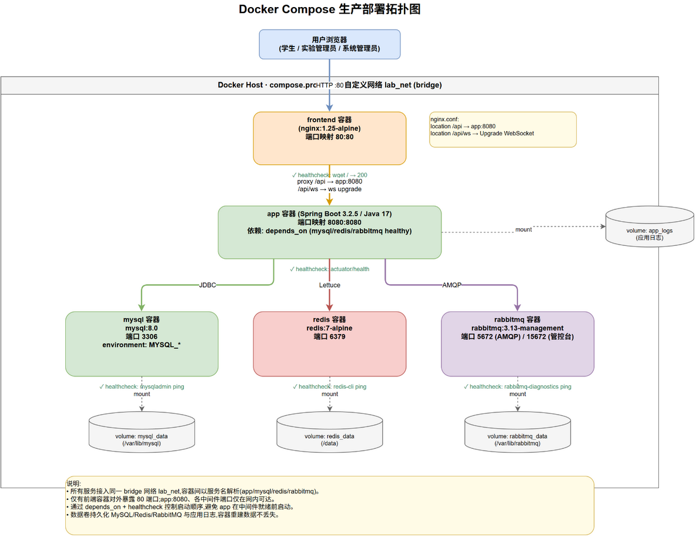

# 总体架构说明

本平台「基于 Spring Boot 的高校实验室设备智能预约与管控平台」采用经典的分层单体架构（Layered Monolith），在一套 Spring Boot 服务中纵向切分表现层、业务层、持久层与基础设施层，横向通过 REST + WebSocket 两种接入协议对前端与第三方暴露能力。之所以选择单体而非微服务，是因为校园实验室预约平台的业务域单一、团队规模小、并发量级有限（百级用户、十级设备），单体在开发效率、部署复杂度与运维成本上明显优于微服务；同时通过 Redis 分布式锁、消息队列异步化、Redis 缓存等中间件手段，将「防超约、实时推送、高聚合查询」等微服务场景下的典型难点在单体内化解，兼顾了工程简洁性与技术深度。

## 分层职责与技术栈

整体自上而下分为四层，每层职责单一、依赖方向向下，禁止反向调用。各层的技术选型与版本如下表所示，所有版本均在 `pom.xml` 与 `frontend/package.json` 中锁定。

| 层次 | 职责 | 技术选型（版本） |
|------|------|------------------|
| 前端表现层 | SPA 渲染、路由、状态管理、图表可视化、实时推送订阅 | Vue `3.5.39` + Vue Router `5.1.0` + Pinia `3.0.4`（持久化插件 `4.7.1`）+ Element-Plus `2.14.2` + ECharts `6.1.0`（按需引入 `Pie/Bar/Line/Heatmap`）+ axios `1.18.1` + SockJS-client `1.6.1` + @stomp/stompjs `7.3.0`；构建工具 Vite `8.1.1`，语言 TypeScript `6.0.2` |
| 接入与反向代理层 | 静态资源托管、SPA history 路由回退、REST 与 WebSocket 反向代理 | Nginx（`nginx:alpine` 镜像） |
| 业务服务层 | 领域建模、事务编排、安全鉴权、并发控制、消息异步化、缓存策略 | Spring Boot `3.2.5`（Java `17`），Spring Security、Spring WebSocket、Spring AMQP；MyBatis-Plus `3.5.5`；Redisson `3.31.0`（分布式锁）；jjwt `0.12.5`（JWT）；Knife4j `4.5.0`（OpenAPI 文档）；Flyway（版本化迁移） |
| 持久与基础设施层 | 关系存储、缓存、消息中间件 | MySQL `8.0`、Redis `7`（Lettuce 客户端）、RabbitMQ `3.13-management` |

业务服务层内部进一步按「Controller（HTTP/WS 入口与参数校验）→ Service（领域逻辑与事务边界）→ Mapper（MyBatis-Plus 数据访问）」三段式组织，Service 层是唯一的事务边界与锁/MQ/缓存编排点，保证业务规则的内聚。

## 请求链路

平台的请求链路分为两类：常规 REST 同步请求与 WebSocket 实时推送。

**REST 链路**（以学生提交预约为例）：浏览器发起 `POST /api/reservations`，经 Nginx 的 `location /api/` 反向代理到后端 `app:8080`（`server.servlet.context-path=/api`），进入 Spring Security 的 JWT 过滤器完成鉴权，由 `ReservationController` 接收参数校验，委托 `ReservationServiceImpl#create` 在事务内依次完成时段对齐校验（`SlotCalculatorService`）、Redisson 分布式锁串行化（`ReservationLock`）、预约主表与 `reservation_item` 明细写入、唯一索引兜底，最后通过 `TransactionSynchronization.afterCommit` 将通知投递到 RabbitMQ，控制器返回标准 `Result` 包装体。整条链路 HTTP 状态恒为 200，业务成败由响应体 `code` 字段区分，这一约定简化了前端的统一错误处理。

**WebSocket 链路**：浏览器通过 SockJS 建立到 `/api/ws` 的连接，握手期由 `WsAuthHandshakeInterceptor` 从 query 参数 `?token=` 解析 JWT 并写入会话属性，`JwtHandshakeHandler` 将 `userId` 设为会话 `Principal` 注册到 `SimpUserRegistry`。建立连接后前端订阅 `/user/queue/notifications`，后端在通知落库后调用 `SimpUserRegistry.convertAndSendToUser(userId, "/queue/notifications", payload)`，消息经 Spring 的 user destination 解析后定向投递到该用户的会话。该链路与 REST 链路共用同一套 JWT 体系，但鉴权点不同：REST 在过滤器链，WebSocket 在握手期。

## 容器化部署拓扑

平台采用 Docker Compose 一键编排，分为开发态（`docker-compose.yml`）与生产态（`docker-compose.prod.yml`）两套配置。

**生产态**由 5 个 service 组成：`mysql`（`mysql:8.0`，`lab-mysql-prod`）、`redis`（`redis:7-alpine`）、`rabbitmq`（`rabbitmq:3.13-management`）、`app`（后端 Spring Boot，多阶段构建）、`frontend`（前端 SPA + Nginx 反代）。为彻底隔离生产与开发的容器命名空间，`docker-compose.prod.yml` 顶部固定 `name: labprod`，避免与开发态默认项目名（目录名）下的同名 service（`mysql/redis/rabbitmq`）碰撞，从而防止 `docker compose -f docker-compose.prod.yml up` 误重建开发容器。

**健康检查与依赖编排**是拓扑可靠性的关键。三个中间件 service 均配置 healthcheck：MySQL 用 `mysqladmin ping`（5s 间隔，20 次重试）、Redis 用 `redis-cli ping`、RabbitMQ 用 `rabbitmq-diagnostics -q ping`（10s 间隔，10 次重试）。`app` 通过 `depends_on` 的 `condition: service_healthy` 显式等待三者就绪后才启动，从根本上避免了「后端先于中间件启动导致连接失败」的经典启动顺序问题。`frontend` 仅 `depends_on: [app]`，对外暴露 `80` 端口。三个中间件均挂载命名卷（`mysql_data`/`redis_data`/`rabbitmq_data`）实现数据持久化，且生产态不向宿主机暴露中间件端口，仅 `frontend` 暴露 80，符合最小暴露面原则。

**多阶段镜像构建**分别由根目录 `Dockerfile`（后端）与 `frontend/Dockerfile`（前端）承担。后端第一阶段用 `maven:3.9-eclipse-temurin-17` 注入阿里云镜像并缓存依赖层、编译出 jar，第二阶段用 `eclipse-temurin:17-jre-jammy` 仅运行 jar，以 `--spring.profiles.active=prod` 激活生产配置；前端第一阶段用 `node:20-alpine` + `pnpm@9` 构建 SPA 产物，第二阶段用 `nginx:alpine` 托管 `dist` 并注入 `nginx.conf`。Nginx 配置三条 location：`/`（SPA 回退）、`/api/ws`（WebSocket 反代，设 `Upgrade/Connection` 头与 86400s 读超时）、`/api/`（REST 反代），其中 `/api/ws` 必须声明在 `/api/` 之前以利用最长前缀匹配优先。

> **答辩要点**
> - 选型理由：单体 + 中间件增强，在校园场景下兼顾开发效率与技术深度，避免微服务的分布式复杂度。
> - 启动顺序：`depends_on: service_healthy` + healthcheck 解决容器编排的启动依赖问题，而非靠 `restart: on-failure` 盲重试。
> - 反向代理：Nginx 同源化 `/api` 与 `/api/ws`，前端 WS URL 无需硬编码后端地址（`VITE_WS_BASE` 留空走相对路径），前后端同源部署消除 CORS 与跨域鉴权复杂度。
> - 镜像分层：多阶段构建将构建环境（Maven/Node）与运行环境（JRE/Nginx）分离，最终镜像体积显著缩小、攻击面收敛。
> - 命名空间隔离：`name: labprod` 是一个容易被忽视但至关重要的工程细节，防止 dev/prod 容器名碰撞。
