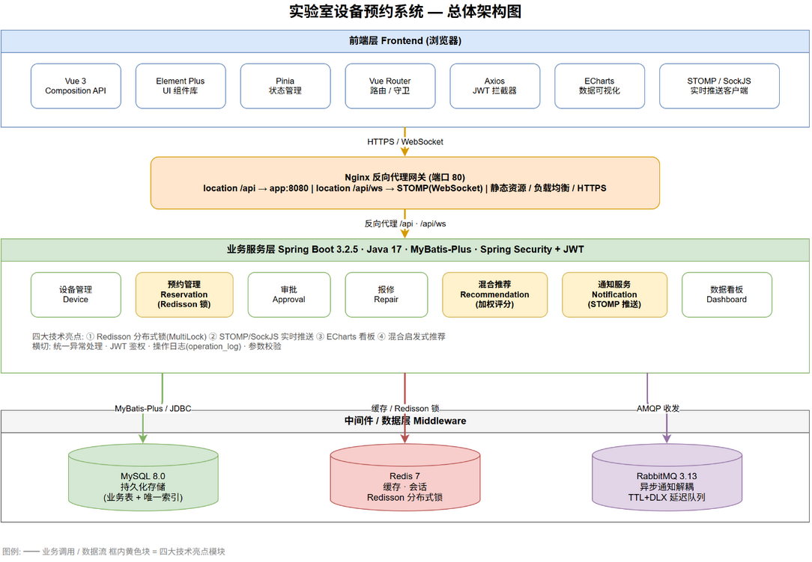

# 总体架构说明

本平台是面向高校实验室的自然日设备预约与管控系统，采用单体异步架构。后端只保留 Python FastAPI，前端使用 Vue 3 + TypeScript；MySQL 保存业务事实，Redis 提供缓存、辅助锁和限流，OutboxWorker 在同一 FastAPI 进程中执行可恢复异步任务。

## 分层职责与技术栈

| 层次 | 职责 | 技术选型 |
|------|------|----------|
| 前端表现层 | SPA、路由、状态、图表、通知和表单 | Vue 3、Vue Router、Pinia、Element Plus、ECharts、Axios、TypeScript |
| 接入层 | 静态资源、REST/SSE/WebSocket 反向代理 | Nginx |
| 应用层 | 鉴权、学院隔离、预约状态机、报修、设备生命周期、缓存和异步任务 | Python 3.13、FastAPI、SQLAlchemy Async、Pydantic |
| 基础设施层 | 事务、缓存、可靠任务、实时提示 | MySQL 8、Redis 7、Alembic、持久化 Outbox、原生 WebSocket |

预约、审批、签到、归还和设备状态变化集中在 `backend/app/application`，Controller 只负责参数校验和调用应用服务。数据库迁移统一由 `backend/migrations` 的 Alembic revision 管理。

## 自然日预约链路

浏览器提交 `POST /api/v2/reservations` 后，服务端按学院范围加载设备，校验维护状态、不可预约日期、用户信用和预约上限；随后按设备和自然日排序获取 Redis 辅助锁，最终依靠 MySQL `v2_reservation_day(device_id, date)` 唯一约束防止并发超约。

预约记录只使用 `start_date`、`end_date` 和日期明细。用户不选择时分秒；`check_in_at`、`check_out_at` 只用于履约审计。连续预约在首日签到、结束日归还，归还时保存验收结果，异常设备自动进入维护状态。

## 异步通知与实时提示

业务事务先写入 Outbox，再由同进程 Worker 使用租约、`SKIP LOCKED`、幂等任务键和退避重试生成通知记录。通知表是历史事实源，原生 WebSocket 只向在线用户推送低延迟提示；客户端断线或刷新后仍通过通知接口补齐历史和未读数。

## 学院隔离

学院是租户边界。普通用户的设备、预约、报修和通知都按当前数据库用户学院过滤；实验室负责人只能管理自己负责的实验室或学院；系统管理员才允许跨学院。权限校验在服务端应用服务中完成，前端菜单隐藏不承担安全职责。

## 容器化

生产环境使用 `docker-compose.prod.yml`，包含 MySQL、Redis、Qdrant、FastAPI app 和前端 Nginx。生产密码和 JWT secret 必须由环境变量提供，缺失或使用默认值时 FastAPI 拒绝启动。部署细节见根目录 `DEPLOY-WITH-WEBHOOK.md`。

## 答辩要点

- 只维护一套 Python 后端，避免双语言双状态机造成的实现漂移。
- 预约正确性由自然日唯一约束兜底，Redis 故障不会导致超约。
- Outbox 让通知、爽约扣分和候补递补在重启后可恢复。
- 条件更新和学院范围校验防止重复状态变更与跨学院越权。
- 预约、签到和归还都保留可追溯业务记录，方便异常处理和审计。
