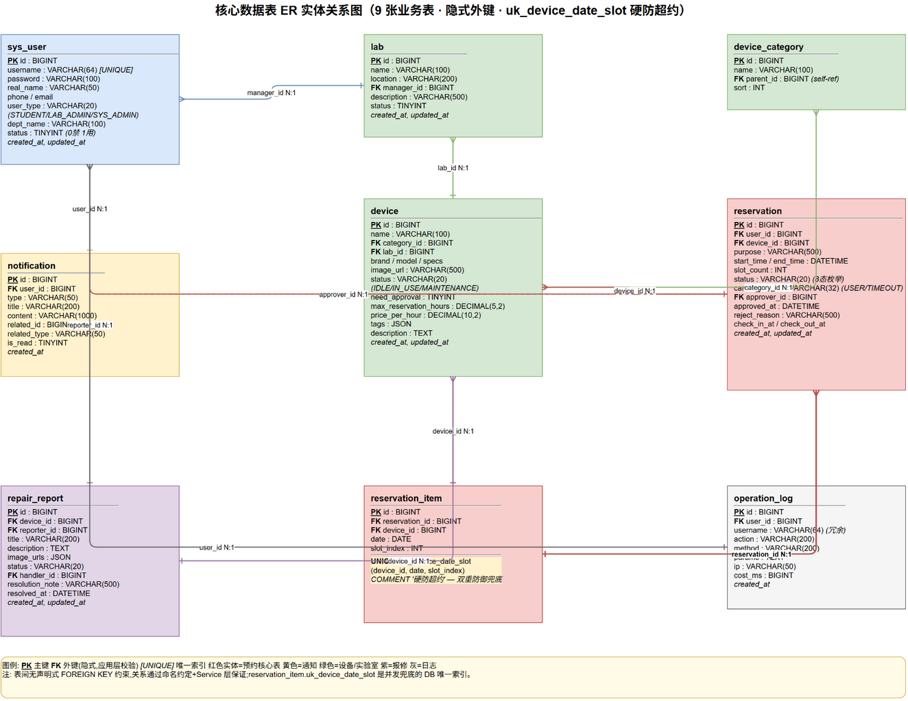

# 数据模型设计

平台的数据模型围绕「用户—设备—预约」这一核心三角展开，辅以 RBAC 权限、报修、通知与审计四类辅助域，共 13 张物理表。全部表使用 InnoDB 引擎与 `utf8mb4` 字符集，通过 Flyway 版本化迁移脚本（`V1__init_schema.sql` 至 `V4__add_cancel_reason.sql`）管理 schema 演进，避免手工 DDL 造成的漂移。需要特别说明的是，本项目持久层采用 MyBatis-Plus 而非 JPA，因此表间关系以逻辑外键（`Long` 型引用列 + 应用层校验）实现，未在 DDL 中声明物理 `FOREIGN KEY` 约束；这一选择换取了批量操作与复杂查询的灵活性，代价是引用完整性由业务代码兜底。



## 核心实体表

### sys_user（用户）

系统的鉴权主体，存储账号口令与基本资料。关键字段包括 `username`（唯一登录名）、`password`（BCrypt 哈希）、`user_type`（账号性质，枚举 `STUDENT/TEACHER/STAFF`，区分学生、教师、教辅）、`status`（`0` 禁用/`1` 正常）。`user_type` 与角色概念相互正交：角色（`sys_role.role_code`，枚举 `STUDENT/LAB_ADMIN/SYS_ADMIN`）决定权限边界，`user_type` 仅表征身份属性，一个学生账号同时拥有 `user_type=STUDENT` 与 `STUDENT` 角色。角色通过 `sys_user_role` 与 `sys_role_permission` 两张桥表实现经典 RBAC 的「用户—角色—权限」多对多映射。

### device（设备）与 device_category、lab

设备是预约的客体，其核心字段决定了预约规则。`status`（`IDLE/IN_USE/MAINTENANCE`）驱动可约性判断；`need_approval`（`0/1`）决定预约是直接进入 `APPROVED` 还是需要 LAB_ADMIN 审批；`max_reservation_hours`（`DECIMAL(5,2)`，默认 `8.00`）限定单次预约时长上限；`tags`（`JSON` 数组）存储语义标签供推荐算法匹配。设备通过 `category_id` 归类到 `device_category`（支持 `parent_id` 自引用形成分类树），通过 `lab_id` 归属到 `lab`（实验室，含 `manager_id` 指向负责的 LAB_ADMIN）。在 `lab_id` 与 `status` 上分别建索引以加速「按实验室筛选」与「按状态筛选」两类高频查询。

### reservation 与 reservation_item（预约主表与时段明细）

这是整个数据模型中设计最核心、也是防超约机制落地之处。`reservation` 是预约的逻辑主体，存储 `user_id`、`device_id`、`start_time`/`end_time`、`slot_count`、`status`（8 态枚举，详见流程章节）、审批信息（`approver_id`/`approved_at`/`reject_reason`）、签到签退时间（`check_in_at`/`check_out_at`），以及 V4 迁移新增的 `cancel_reason`。`reservation_item` 是预约的物理时段展开表：一条预约按 15 分钟槽粒度展开为 1..N 条明细，每条记录 `(reservation_id, device_id, date, slot_index)` 四元组。

防超约的全部秘密在于 `reservation_item` 上的唯一索引：

```sql
UNIQUE KEY uk_device_date_slot (device_id, date, slot_index) COMMENT '硬防超约'
```

该索引以「设备 + 日期 + 槽序号」为唯一性约束，从数据库底层保证「同一设备的同一时段全局至多被一条预约占用」。无论上层并发如何竞争，只要两条记录试图落入相同的 `(device_id, date, slot_index)`，InnoDB 就会抛出 `DuplicateKeyException`，被 `GlobalExceptionHandler` 捕获并转换为业务码 `RESERVATION_CONFLICT(409)`。这是与 Redisson 分布式锁并行的「第二道防线」——即便分布式锁因 Redis 故障而 fail-open 放行，唯一索引仍能在 DB 层兜底，保证数据正确性。

`cancel_reason` 字段（`VARCHAR(32)`，V4 迁移新增）配合 `status=CANCELLED` 使用，枚举值为 `USER`（用户主动取消）与 `TIMEOUT`（超时未签到由延迟队列自动取消），用于区分取消来源、支撑违约统计与信用画像。这一设计将「为什么取消」与「当前是什么状态」解耦：状态机只描述生命周期节点，而 `cancel_reason` 作为注解附加在 `CANCELLED` 节点上，避免为每种取消来源单独设立状态导致状态爆炸。

### notification（通知）与 repair_report（报修）

`notification` 是站内消息表，`user_id` 指向接收人，`type` 标识业务来源（`RESERVATION/APPROVAL/REPAIR`），`related_id` + `related_type` 采用多态关联指向具体业务实体（预约或报修），`is_read` 标记已读。多态关联而非物理外键，是因为通知可能关联多种实体，物理外键会限制扩展性。`repair_report` 记录设备故障，`device_id` 指向故障设备、`reporter_id` 指向报修人、`handler_id` 指向处理人（LAB_ADMIN/SYS_ADMIN），`status` 为 `PENDING/PROCESSING/RESOLVED/REJECTED` 四态，`image_urls` 为 JSON 数组存储现场照片。

### operation_log（操作审计）

全量记录敏感操作轨迹，`user_id` + `username`（冗余存储用户名以应对账号删除场景）、`action`（操作描述）、`method`（调用方法）、`params`（参数快照）、`ip`、`cost_ms`（耗时）。通过 AOP 切面在 Controller 方法环绕通知中异步落库，为事后审计与性能分析提供数据基础。

## 关系总览

| 父表 → 子表 | 基数 | 外键列 | 约束 |
|------------|------|--------|------|
| sys_user ↔ sys_role | M:N（经 sys_user_role） | user_id, role_id | UNIQUE 桥表 |
| sys_role ↔ sys_permission | M:N（经 sys_role_permission） | role_id, permission_id | UNIQUE 桥表 |
| lab → device | 1:N | device.lab_id | idx_lab |
| device_category → device | 1:N | device.category_id | — |
| sys_user → reservation | 1:N（申请人） | reservation.user_id | idx_user_status |
| device → reservation | 1:N | reservation.device_id | idx_device_status |
| sys_user → reservation | 1:N（审批人） | reservation.approver_id | — |
| reservation → reservation_item | 1:N | reservation_item.reservation_id | idx_reservation |
| device → repair_report | 1:N | repair_report.device_id | idx_device |
| sys_user → notification | 1:N | notification.user_id | idx_user_read |
| sys_user → operation_log | 1:N | operation_log.user_id | idx_user |

其中 `reservation → reservation_item` 的 1:N 展开，使得「按设备 + 日期查询占用槽」这类防超约校验的高频查询可以直接在 `reservation_item` 上完成，而无需反查主表的 `start_time/end_time` 做区间运算——槽位是离散的整数，区间判断退化为集合成员判断，既简化了查询逻辑，又让唯一索引能够精确生效。

> **答辩要点**
> - 防超约落到 DB 层：`uk_device_date_slot` 唯一索引是「硬防超约」的最终兜底，即使分布式锁失效仍能保证一致性，这是数据完整性优先于性能的设计哲学。
> - 槽粒度展开：将预约展开为 `reservation_item` 明细，把区间重叠判断转化为离散槽位的唯一性判断，是模型层的关键抽象。
> - 逻辑外键 + 应用层校验：放弃物理外键换取查询灵活性，引用完整性由 Service 层保证，适合读多写少、关联查询复杂的业务系统。
> - `cancel_reason` 解耦：用注解字段而非新增状态值区分取消来源，保持状态机的简洁性。
> - Flyway 版本化迁移：schema 演进可追溯、可回滚，避免环境间漂移。
