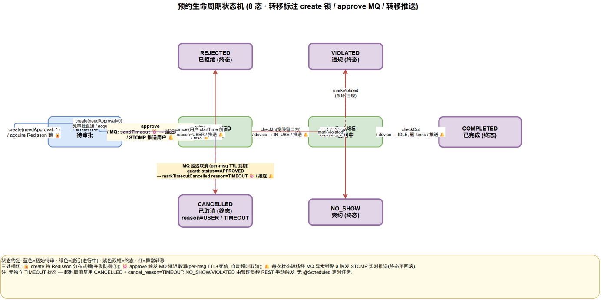

# 核心业务流程

预约是平台的主线业务，其生命周期覆盖「创建—审批—签到—使用—归还」的正常路径，以及「取消、驳回、超时、违约、爽约」等异常分支。状态机、并发控制、消息异步化与实时推送在这条主线上交织，是平台技术集成的集中体现。本章先给出状态机的全景，再逐步标注锁、MQ、推送的介入时机。



## 状态机定义

预约状态由 `ReservationStatus` 枚举定义，共 8 个节点：

```java
PENDING, APPROVED, IN_USE, COMPLETED, REJECTED, CANCELLED, VIOLATED, NO_SHOW
```

其中 `PENDING → APPROVED → IN_USE → COMPLETED` 是正常主线，`REJECTED`、`CANCELLED`、`VIOLATED`、`NO_SHOW` 是异常终态。`CANCELLED` 节点附加 `cancel_reason`（`USER`/`TIMEOUT`）区分取消来源，避免为每种来源单独设状态导致状态爆炸。

## 创建：双层防超约的入口

学生提交 `POST /api/reservations` 后，`ReservationServiceImpl#create` 在事务内依次执行：

1. **时段校验**：`SlotCalculatorService.compute` 将 `[startTime, endTime)` 按 15 分钟对齐、校验落入 08:00–22:00 工作窗、按 `max_reservation_hours` 上限换算为槽上限（`EXCEED_MAX_DURATION`），输出 `SlotKey(deviceId, date, slotIndex)` 列表。槽位是离散整数，区间重叠判断在此退化为集合成员判断，为唯一索引铺路。
2. **初始状态分流**：若设备 `need_approval=1` 则 `status=PENDING`（待 LAB_ADMIN 审批），否则直接 `status=APPROVED`（免审设备即时生效）。
3. **双层防超约**：`ReservationLock.acquire(deviceId, dates)` 获取 Redisson `MultiLock`（键 `lock:dev:{deviceId}:{date}`，`leaseTime=-1` 看门狗续期），锁内写入 `reservation` 主表与 `reservation_item` 明细；若 DB 唯一索引 `uk_device_date_slot` 命中（并发漏过锁的极端情况）抛 `DuplicateKeyException` 转 `RESERVATION_CONFLICT`。Redis 故障时锁 fail-open，由 DB 唯一索引独立兜底。
4. **after-commit 通知**：事务提交后由 `NotificationProducer` 向 `notify.exchange` 投递通知消息（`RESERVATION` 类型，标题随审批需求动态为「预约成功」或「预约已提交，待审批」）。

若设备 `need_approval=1`，流程停在 `PENDING` 等待审批；否则进入 `APPROVED` 并由 `ApprovalServiceImpl.approve` 的等价逻辑触发延迟队列（见下文）。

## 审批：延迟队列的起点

LAB_ADMIN 在 `POST /api/approvals/{id}/approve` 或 `/reject` 处理待审批预约：

- **approve（PENDING → APPROVED）**：置 `approver_id`/`approved_at`，**并在同一事务内向延迟队列投递超时消息** `timeoutProducer.sendTimeout(reservationId, startTime)`（消息发送注册到 afterCommit）。该消息的 TTL = `startTime - now + graceMinutes(30min)`，标志着「签到截止时钟」开始计时。
- **reject（PENDING → REJECTED）**：置 `reject_reason`，释放 `reservation_item` 占用（明细行删除，槽位回归可约池），发送 `APPROVAL` 类型「预约被拒」通知。

两条审批分支均在 afterCommit 投递通知，通知经 MQ 异步落库 + WS 推送触达学生。

## 签到与归还：在用态的进出

- **checkIn（APPROVED → IN_USE）**：学生在预约时间窗内 `POST /api/reservations/{id}/check-in`，校验时间窗后置 `check_in_at`、状态转 `IN_USE`，并把设备 `status` 从 `IDLE` 翻转为 `IN_USE`（防止他人在用期间重复预约）。此动作同时让延迟队列的「超时取消」消费者失效——即便过期消息到达，消费者校验状态非 `APPROVED` 即跳过。
- **checkOut（IN_USE → COMPLETED）**：学生 `POST /api/reservations/{id}/check-out` 归还设备，置 `check_out_at`、状态转 `COMPLETED`，设备 `status` 回到 `IDLE`，`reservation_item` 明细释放。

## 异常分支：取消、超时、违约、爽约

- **用户取消（PENDING/APPROVED → CANCELLED, cancel_reason=USER）**：学生在 `start_time` 之前可主动取消，置 `cancel_reason=USER`，释放明细与设备状态。已进入 `IN_USE` 的预约不可取消（需走归还流程）。
- **超时未签到自动取消（APPROVED → CANCELLED, cancel_reason=TIMEOUT）**：审批通过后投递的延迟消息在 `startTime + 30min` 后过期，经 DLX 路由到 `reservation.cancel.queue`，`ReservationTimeoutConsumer` 消费：校验状态仍为 `APPROVED`（幂等性核心——已签到的 `IN_USE` 直接跳过），调用 `markTimeoutCancelled` 置 `CANCELLED`/`cancel_reason=TIMEOUT`，释放设备，并发送系统通知「预约超时已自动取消」。这是延迟队列 + DLX 的典型应用，把「轮询扫描过期预约」的定时任务转化为事件驱动的精准触发。
- **违约标记（APPROVED/IN_USE → VIOLATED）**：管理员对违规使用（如超时未还、损坏设备）手动标记违约，释放设备。
- **爽约标记（APPROVED → NO_SHOW）**：管理员对审批通过但从未签到的预约标记爽约（与超时自动取消互补：超时是系统自动、爽约是人工裁量）。

## 锁 / MQ / 推送的交互标记

整条生命周期中，三类横切机制在关键节点介入：

| 节点 | 分布式锁 | RabbitMQ | WebSocket 推送 |
|------|---------|----------|----------------|
| 创建 | `lock:dev:{deviceId}:{date}` MultiLock + DB 唯一索引 | afterCommit 投递 `RESERVATION` 通知 | — |
| 审批通过 | — | afterCommit 投递 `APPROVAL` 通知 + 投递延迟消息（TTL=startTime+grace-now） | 推送审批结果 |
| 审批驳回 | — | afterCommit 投递 `APPROVAL` 通知 + 释放明细 | 推送驳回原因 |
| 用户取消 | — | afterCommit 投递 `RESERVATION` 通知 + 释放明细 | 推送取消确认 |
| 签到 | — | afterCommit 投递 `RESERVATION` 通知；使延迟消息幂等失效 | 推送签到确认 |
| 归还 | — | afterCommit 投递 `RESERVATION` 通知 + 释放明细 | 推送完成确认 |
| 超时取消 | — | 延迟消息过期 → DLX → 消费者 markTimeoutCancelled + 系统通知 | 推送自动取消 |
| 违约/爽约 | — | afterCommit 投递通知 + 释放明细 | 推送状态变更 |

值得强调的三个交互细节：第一，**所有 MQ 投递都在 afterCommit**，保证只有事务成功的业务事件才会被消费，杜绝幻觉通知。第二，**签到让延迟消息幂等失效**——延迟消费者以「状态仍为 APPROVED」为前置条件，签到后状态变为 `IN_USE`，过期消息到达时直接跳过，这是用业务状态做天然幂等键的优雅设计。第三，**WS 推送与 DB 事务解耦**——推送调用包裹在 try/catch 中、且在事务提交后的消费阶段执行，推送失败（用户离线、连接断开）不影响 DB 状态正确性，用户下次上线可从 `notification` 表拉取未读消息补偿。

> **答辩要点**
> - 状态机 + cancel_reason 注解：8 态覆盖全部分支，`CANCELLED` 用注解字段而非新增状态避免爆炸，状态机简洁。
> - 创建节点的双层防超约 + 审批节点的延迟队列投递，是生命周期中技术密度最高的两个节点。
> - 签到让延迟消息幂等失效：业务状态作为天然幂等键，无需额外去重表，是领域建模与中间件配合的范例。
> - 全链路 afterCommit：根治幻觉通知，是消息可靠性的第一性原则。
> - 推送与事务解耦：DB 是 source of truth，推送 best-effort，可用性优先。
