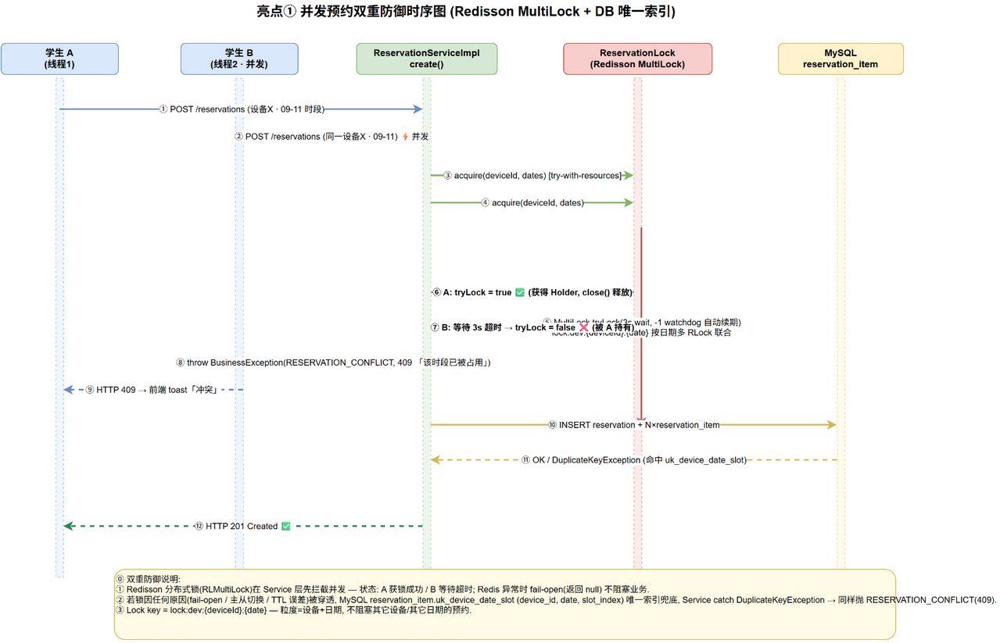
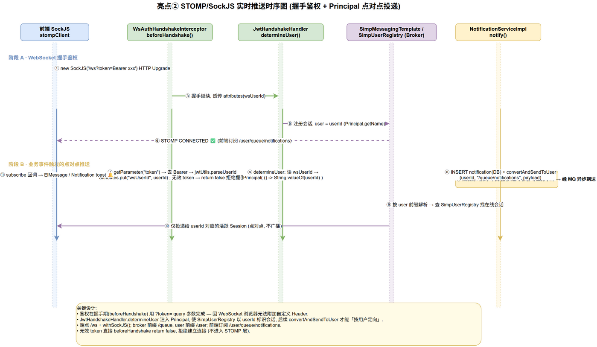
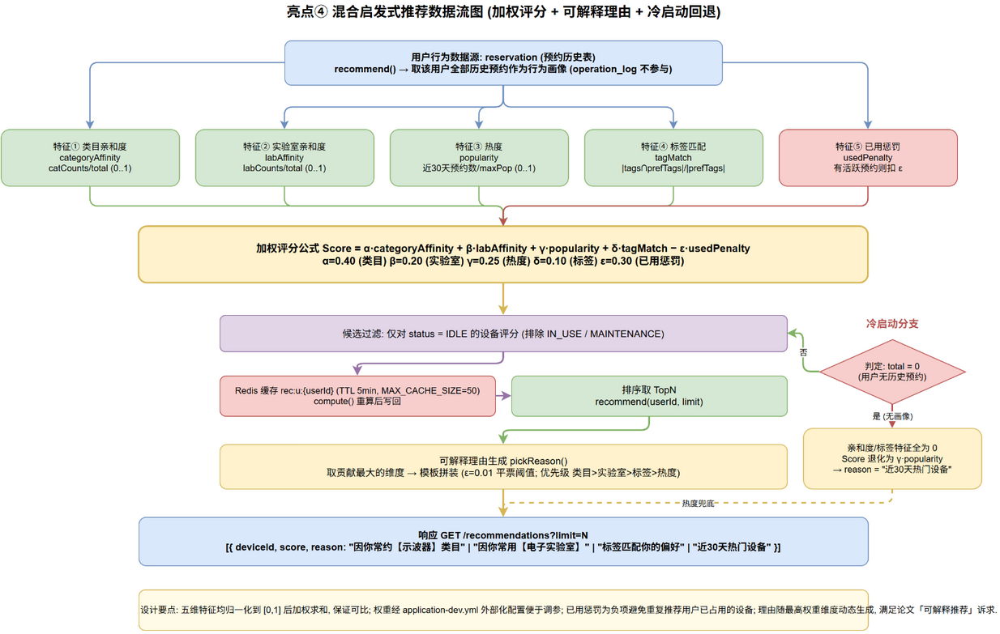
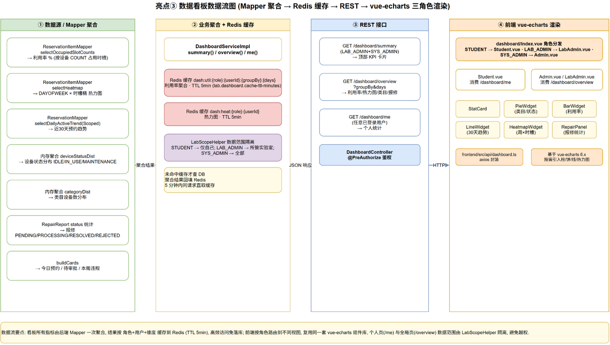
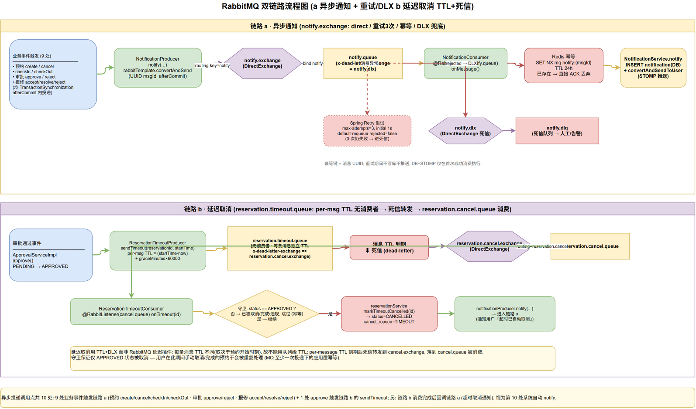

# 五大技术亮点原理

本平台在常规的 CRUD 之上，针对「高并发防超约、实时消息触达、个性化推荐、数据可视化、系统解耦」五个工程难点分别给出了可落地的技术方案。这五个亮点既是平台的核心技术增量，也是论文的重点论述对象。下图（04a–04d、05）分别对应五个亮点的时序与数据流，下文逐项阐述其原理、关键代码与工程取舍。

## 亮点一：Redisson 分布式锁防超约

防超约是预约类系统的生命线。平台采用「Redis 分布式锁 + DB 唯一索引」的双层防线架构，其中 Redisson 分布式锁是第一道、也是主要的一道防线。



锁的核心实现位于 `ReservationLock`，针对一次预约涉及的 `(deviceId, date)` 组合加 Redisson `MultiLock`：

```java
RLock[] locks = dates.stream()
    .map(date -> client.getLock("lock:dev:" + deviceId + ":" + date))
    .toArray(RLock[]::new);
RLock multi = client.getMultiLock(locks);
boolean locked = multi.tryLock(waitSeconds, -1, TimeUnit.SECONDS); // -1 触发看门狗
```

锁键 `lock:dev:{deviceId}:{date}` 的粒度选择是关键：以「设备 + 日期」为粒度，既能保证同一设备同一天的预约串行化（彻底消除并发竞争），又不会把不同日期的预约无谓地串行（保留跨日并行能力）。`tryLock` 的第二参数 `leaseTime = -1` 是显式启用 Redisson 的看门狗（watchdog）机制——锁不设固定过期时间，而是由后台线程每 1/3 个 `lockWatchdogTimeout`（默认 30s）自动续期，从而既避免了「业务未完成锁先过期」的危险，又能在持有锁的 JVM 崩溃后由看门狗超时回收，保证不会死锁。`waitSeconds` 默认 3 秒，让并发请求有秩序地排队而非立即失败。

工程鲁棒性体现在 fail-open 策略：当 Redis 本身不可用时（`tryLock` 抛 `RuntimeException`），`ReservationLock` 不阻断主流程，而是返回一个空的 `Holder`（`null`），让请求继续走到 DB 层，由 `reservation_item` 的唯一索引 `uk_device_date_slot` 兜底。这一设计在 `ReservationServiceImpl#create` 中体现为「锁内写明细，捕获 `DuplicateKeyException` 转 `RESERVATION_CONFLICT`」：

```java
try (var ignored = reservationLock.acquire(dto.getDeviceId(), dates)) {
    reservationMapper.insert(r);
    try {
        for (SlotKey s : slots) { /* 逐条写 reservation_item */ }
    } catch (DuplicateKeyException e) {
        throw new BusinessException(ResultCode.RESERVATION_CONFLICT);
    }
}
```

压测验证了双层防线的有效性：JMeter 50 线程经 Synchronizing Timer 同步后对「同一设备 + 同一时段」瞬时并发预约，实测恰好 1 个成功、49 个返回 `RESERVATION_CONFLICT(409)`、0 个其它错误，证明防超约严格成立。时延方面 P50=935ms、P95=1246ms，偏高是 Synchronizing Timer 把 50 个请求压到同一瞬、全部进入锁的串行队列所致，属预期行为。

> **答辩要点**
> - 锁粒度 `(deviceId, date)`：在正确性与并发度之间取得平衡，不同日期可并行、同日严格串行。
> - `leaseTime = -1` 看门狗：兼顾「业务未完锁不过期」与「JVM 崩溃不死锁」。
> - fail-open + DB 唯一索引：Redis 故障时降级而非阻断，DB 唯一索引作为最后兜底，可用性与正确性兼得。
> - 压测实证：50 并发 → 1 成功 / 49 冲突，是论文最强硬的实证依据之一。

## 亮点二：STOMP/SockJS 实时推送

预约状态变更（审批通过、超时取消、报修进展）需要实时触达用户，平台基于 Spring WebSocket + STOMP 协议 + SockJS 兼容层实现定向推送。



鉴权是 WebSocket 推送的首要难题。Spring 的 `convertAndSendToUser(userId, ...)` 依赖 `SimpUserRegistry` 按「握手期 Principal」建立的用户会话映射，而浏览器原生 WebSocket/SockJS 在握手的 HTTP Upgrade 请求中**无法添加自定义请求头**——这意味着 STOMP 的 `CONNECT` 帧里设置鉴权头是无效的，Principal 不会注册到 registry，推送会被静默丢弃（实测 `totalUsers=0`）。因此平台采用「握手期 query token」方案：`WsAuthHandshakeInterceptor` 在 `beforeHandshake` 阶段从 `?token=` 参数解析 JWT、校验并将 `userId` 写入会话属性，`JwtHandshakeHandler` 覆盖 `DefaultHandshakeHandler.determineUser` 把 `userId` 设为会话 Principal，从而注册到 registry：

```java
// WsAuthHandshakeInterceptor
String token = servlet.getServletRequest().getParameter("token");
Long userId = jwtUtils.parseUserId(token);
attributes.put(WS_USER_ID, userId);  // 供 Handler 读取
```

端点实际路径为 `/api/ws`（`context-path=/api` + endpoint `/ws`），前端订阅 `/user/queue/notifications`，后端落库后调用：

```java
messagingTemplate.convertAndSendToUser(
    String.valueOf(userId), "/queue/notifications", payload);
```

消息经 user destination prefix `/user` 解析后定向投递到该用户的所有会话。这一方案是浏览器 WebSocket 鉴权的标准做法，trade-off 是 token 出现在 query string（会被记入访问日志），可通过改用 Cookie/Session 方案规避，本毕设接受此取舍。推送调用包裹在 try/catch 中，WebSocket 推送失败不会回滚外层的 `@Transactional`，保证 DB 状态与推送的解耦。

> **答辩要点**
> - 为何不用 CONNECT 头鉴权：浏览器 WebSocket 握手期不能加自定义头，`SimpUserRegistry` 按握手期 Principal 映射，CONNECT 帧 Principal 不会注册——这是踩坑后的实现修订，论文诚实记录。
> - query token 是浏览器 WS 鉴权的标准做法，trade-off 已知并接受。
> - 推送失败不影响事务：DB 是 source of truth，推送是 best-effort，避免推送抖动拖垮业务事务。

## 亮点三：混合启发式推荐

平台为 STUDENT 提供「猜你想约」的设备推荐，采用混合启发式打分算法，兼顾个性化与可解释性。



打分公式综合五维特征：

```
Score(d, u) = α·categoryAffinity + β·labAffinity + γ·popularity + δ·tagMatch − ε·usedPenalty
```

权重默认 `α=0.4, β=0.2, γ=0.25, δ=0.1, ε=0.3`（外部化于 `application.yml` 的 `lab.recommend.weights`，可热调）。各分量语义如下：

- **categoryAffinity（类目亲和度，α=0.4）**：统计用户历史预约中各 `categoryId` 的占比，反映用户偏好哪一类设备。权重最高，是主导因子。
- **labAffinity（实验室亲和度，β=0.2）**：统计用户常去哪个实验室，捕捉地理位置/习惯偏好。
- **popularity（全站热门度，γ=0.25）**：以最近 30 天全站预约次数归一化，引入群体智慧，缓解纯个性化的小样本偏差。
- **tagMatch（标签匹配，δ=0.1）**：用户历史设备标签频率与候选设备 `tags` 的交集占比，捕捉细粒度兴趣。
- **usedPenalty（活跃预约惩罚，ε=0.3）**：若用户对该设备已有 `PENDING/APPROVED/IN_USE` 活跃预约，直接扣 ε 分，避免重复推荐「正在用」的设备。

候选集仅纳入 `status=IDLE` 的可约设备，按 `score` 降序、`deviceId` 升序排序后取 top-N。算法的关键工程价值在于**可解释性**：`pickReason` 方法比较各分项加权贡献，选最大者生成自然语言理由（如「因你常约【光学仪器】类目」「近30天热门设备」），让用户明白「为什么推荐它」，而非黑盒打分。冷启动场景（新用户无历史）下前四项自然为 0，公式退化为 `score = γ·popularity`，结果按全站热门度排序，理由统一回退为「近30天热门设备」，平滑度过冷启动期。推荐结果以 `rec:u:{userId}` 为键缓存 5 分钟，避免短时重复计算。

压测显示推荐接口在 100 并发、2000 样本下吞吐 104.0 req/s、P95=22ms、P99=42ms、零错误，缓存命中使 P50 从 12ms 降至 9ms。

> **答辩要点**
> - 混合而非单一：五维特征覆盖个性化（α/β/δ）、群体智慧（γ）、业务约束（ε），互为补充。
> - 可解释性是工程价值：`pickReason` 把最大贡献分量翻译成自然语言，解决「黑盒推荐」的可信度问题。
> - 冷启动优雅退化：无历史时公式自然退化为热门度排序，无需特殊分支。
> - 权重外部化：`application.yml` 可调，便于 A/B 与后续模型迭代。

## 亮点四：ECharts 驾驶舱

管理员与学生在首页看到的是一个数据驾驶舱，由后端富聚合接口 + 前端 ECharts 可视化组成。



后端在 `DashboardController` 暴露三个按角色分权的端点：`/api/dashboard/summary`（LAB_ADMIN/SYS_ADMIN 概览卡片）、`/api/dashboard/overview?groupBy=&days=`（管理驾驶舱，含设备状态饼图、30 天趋势折线、类目分布、报修统计、利用率柱图、热力图）、`/api/dashboard/me`（学生个人视图，含我的预约状态分布、个人趋势、常用类目、未读消息数）。`overview` 的聚合查询较重（多表 GROUP BY、日期范围扫描），为保护 DB 设计了 Redis 缓存：利用率结果以 `dash:util:{role}:{userId}:{groupBy}:{days}` 为键、热力图以 `dash:heat:{role}:{userId}` 为键，TTL 均为 5 分钟（300 秒）。采用 `StringRedisTemplate` 手动读写（JSON 序列化），缓存读失败降级为回源查询、写失败忽略不影响主流程：

```java
String key = String.format("dash:util:%s:%s:%s:%d", role, userId, groupBy, days);
T cached = readCache(key, typeRef);  // miss/异常返回 null
if (cached != null) return cached;
T result = computeFromDb(...);
writeCache(key, result);  // TTL 5min，写失败仅 warn 日志
return result;
```

前端 ECharts 按需注册 `PieChart/BarChart/LineChart/HeatmapChart` 及配套的 tooltip/legend/grid 组件实现 tree-shaking，封装 `BaseChart` + `LineWidget/PieWidget/BarWidget/HeatmapWidget` 四个业务组件，分别承载 `Admin.vue`（管理驾驶舱）与 `Student.vue`（学生视图）。热力图采用稀疏列表契约（仅返回非零单元格的 `weekday/hour/value`），减少大表的全量传输。

压测显示驾驶舱接口在 100 并发、2000 样本下吞吐 102.9 req/s、P95=35ms、P99=59ms、零错误，缓存命中使 P95 从 40ms 降至 33ms，在小数据量下收益温和但随数据规模扩大会更显著。

> **答辩要点**
> - 角色分权：三个端点按 `hasAnyRole` 区分管理端与学生端，数据范围由 `LabScopeHelper` 进一步收敛（LAB_ADMIN 只看自己管辖的实验室）。
> - 重查询缓存：富聚合接口是典型的缓存受益场景，`dash:util`/`dash:heat` 双 key、5 分钟 TTL 平衡了实时性与 DB 压力。
> - 缓存容错：读失败降级回源、写失败静默，缓存不可用不影响功能正确性，只是性能回落。
> - 前端按需引入：ECharts tree-shaking 控制首屏体积。

## 亮点五：RabbitMQ 异步解耦与延迟队列

Phase 4 引入 RabbitMQ 完成两类使命：通知的异步解耦与超时未签到的延迟自动取消。



**异步通知链路**将原本同步、串行的「业务事务 + 通知发送 + WS 推送」拆分为「业务事务 → 提交后投递 MQ → 消费者异步落库 + 推送」。全站共 10 处通知触发点（9 处业务 + 1 处系统）：业务侧覆盖预约创建/取消/签到/归还、审批通过/驳回、报修受理/解决/驳回；系统侧为延迟队列触发的「超时自动取消」通知。投递时机严格遵循 **transaction-after-commit** 模式——`NotificationProducer` 通过 `TransactionSynchronizationManager.registerSynchronization` 把 MQ 发送注册到事务的 `afterCommit` 回调，仅当业务事务成功提交后才真正发出消息，从根上杜绝了「先发消息、后事务回滚」导致的幻觉通知（消费者收到一条 DB 里根本不存在的业务事件）。

消费侧做了两层可靠性保障。其一是 **Redis 幂等去重**：每条消息携带 UUID `msgId`，消费者用 `SETNX mq:notify:{msgId}` （TTL 24 小时）抢占处理权，重复投递直接跳过，应对 Broker 的 at-least-once 重投递。其二是 **重试 + DLQ**：Spring AMQP 监听器配置 `max-attempts=3`、`initial-interval=1000ms` 指数退避、`default-requeue-rejected=false`，重试耗尽后消息经队列声明的 `x-dead-letter-exchange=notify.dlx` 路由到 `notify.dlq` 死信队列，便于人工排查与重放，而非无声丢失。

**延迟队列链路**实现「审批通过后，若用户在签到截止时间（`startTime + 30min grace`）内未签到则自动取消预约」。平台采用 **per-message TTL + DLX** 的原生方案，而非引入 `rabbitmq-delayed-message-exchange` 插件：审批通过时 `ReservationTimeoutProducer` 向 `reservation.timeout.queue`（无消费者、仅作 TTL 暂存）投递一条消息，通过 `MessageProperties.setExpiration(ttlMillis)` 设置该消息的存活时间（`ttl = startTime - now + graceMinutes×60s`），消息过期后经 `x-dead-letter-exchange=reservation.cancel.exchange` 路由到 `reservation.cancel.queue`，由 `ReservationTimeoutConsumer` 消费——校验预约状态仍为 `APPROVED`（幂等性保证：若用户已签到则状态变为 `IN_USE`，直接跳过），调用 `markTimeoutCancelled` 将状态置为 `CANCELLED`、`cancel_reason=TIMEOUT`，并发送系统通知。

原生 TTL 方案的一个已知取舍是**队头阻塞（head-of-line blocking）**：RabbitMQ 仅在队列头部评估消息过期，若队首消息未过期，其后即便已过期的消息也不会出队。平台接受此限制的理由是：预约消息按审批时间近似有序投递、TTL 相近（都指向各自的未来 `startTime`），队头阻塞的实际影响可控；若需彻底消除可改用 `rabbitmq-delayed-message-exchange` 插件，但会引入部署依赖，权衡后选择原生方案并在论文中诚实记录。此外，延迟消费者与通知之间的「自动取消提交 + 系统通知」存在一个已知 race：若 Broker 在取消事务提交与通知发送之间宕机，重投递时会因状态已非 `APPROVED` 而跳过通知，导致实时推送丢失（DB 状态仍正确），完整修复需引入事务性 outbox，本毕设将其列为未来工作。

> **答辩要点**
> - after-commit 投递：根治「事务回滚但消息已发」的幻觉通知，是消息可靠性的第一性原则。
> - 双层可靠性：Redis SETNX 幂等 + Spring Retry/DLQ，应对 at-least-once 投递与瞬时消费失败。
> - 延迟队列用原生 TTL+DLX 而非插件：减少部署依赖，代价是队头阻塞，在预约场景影响可控——是典型的工程权衡。
> - 幂等消费：延迟消费者以「状态仍为 APPROVED 才取消」作为业务幂等键，天然抗重复消费。
> - 已知取舍诚实记录：取消事务与系统通知间的 race、队头阻塞，论文不回避，体现工程严谨性。
